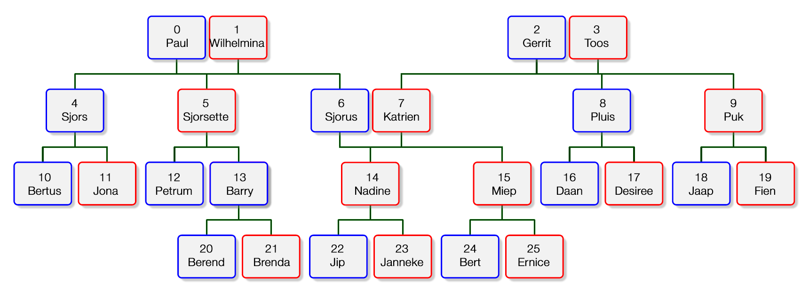

# CLASSES EXERCISE

 

recreate this family with code, On every person i need to be able to ask what are you.
With a function on this person called getRelationTitle(person)

__tip:__
 - Use classes


__Maybe use this?__
```js
class Person {
    constructor(){
        this.parents = [];
        this.children = [];
    }

    getRelationTitle(person){
      // i need to return my title, example like. parent, grandparent, GreatGrandParent, Child etc.
    }
}
```

### Good Luck